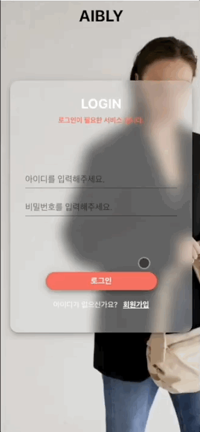

# AI-BLY

### [서비스 시연영상 링크](https://youtu.be/FvNbOo4l1w4)

 

## 🗂 목차

- [**프로젝트 소개**](#1)
- [**역할**](#2)
- [**기획 내용**](#3)
- [**기술 스택**](#4)
- [**구현 기능**](#5)
- [**개발 기간**](#6)
- [**웹서비스 소개**](#7)

 

## 💁‍♂️ 프로젝트 소개

- 주제: AI 이미지 분석을 활용한 해외직구 상품 추천
- 프로젝트로 해결하고 싶은 문제:
  - 25-35대 여성 소비자: 직구시 해외사이트의 접근성 문제 해결
  - 해외 백화점 쇼핑몰 : 기존 재고처리문제 및 해외 직구유저 유입방안 부재에 대한 제안

 

## 역할

| 이름   | 담당 업무 |
| ------ | --------- |
| 손상준 | PM, FE    |
| 김수영 | FE        |
| 정현구 | BE        |
| 현암   | BE        |
| 강현우 | AI        |

 

## 기획내용

- 인포메이션 아키텍쳐

- 와이어 프레임

 

## 🛠 기술 스택

| 분류        | Tools      | 목적         |
| ----------- | ---------- | ------------ |
| Development | Docker     | 배포         |
| Server      | Django     | 웹 서버 구동 |
| DB          | postgresql | Database     |
| Client      | React      | 웹 UI 구현   |
| AI          | Tensorflow | AI           |

 

## 💡 구현 기능

1. 해외 직구사이트 상품 추천

   - 1순위 : 해외 상품 크롤링 및 제공
   - 2순위 : 이미지 + 스타일 선택기반 추천

2. 이미지 업로드시 유사 상품 추천
   - 1순위 : 이미지 업로드 기능 /이미지 분석기능
   - 2순위 : 크롤링된 이미지 중 유사 이미지 추천
   

    

## 🗓 개발 기간

 

## ⭐️ 웹서비스 소개

|              랜딩 페이지 및 튜토리얼               |                메인 페이지                 |
| :------------------------------------------------: | :----------------------------------------: |
|  |  |

|              로그인 및 회원가입              |                     클로젯                     |
| :------------------------------------------: | :--------------------------------------------: |
|  |  |

|                      카테고리                      |                   좋아요                   |
| :------------------------------------------------: | :----------------------------------------: |
|  |  |

|                 추천 스타일                  |
| :------------------------------------------: |
|  |
